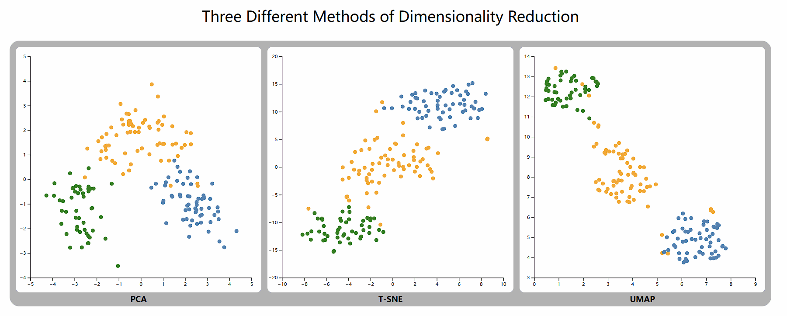
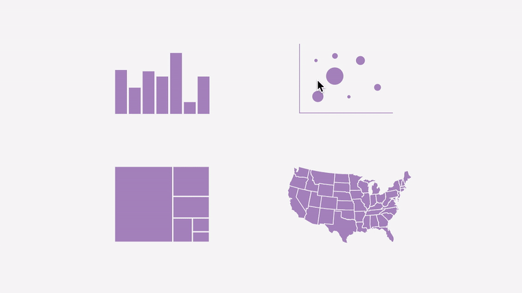

# ARTS 1422: Data Visualization, Fall 2025

## Homework 2

**Deadline: Nov. 3 at 23:59**. No late submission will be accepted.

Note that `D3.js` is the only library allowed to finish this assignment. Please use D3 v4 or above. Furthermore, the use of the `Vue` framework is **mandatory** for this assignment, and you should utilize Vue 2.x or above.

Feel free to use the example of the `Vue` framework we provided in [Piazza]( https://piazza.com/shanghaitech.edu.cn/fall2025/arts1422/resources).

### **Problem**:
**Comparing Dimensionality Reduction Techniques via `D3.js` and `Vue`.
**

In this homework assignment, you will explore different methods of dimensionality reduction and visualize their results using `D3.js` and `Vue`. Your goal is to create an interactive visualization that allows users to compare the performance of different dimensionality reduction techniques on a given dataset.

**Note:** You are required to implement the functionality demonstrated in the following example GIF. Yet, you may design the visual style and interaction details freely, as long as the core functionality shown in the GIF is correctly implemented.

#### **Dataset:**
The data are the results of a chemical analysis of wines grown in the same region in Italy but derived from three different cultivars. The analysis determined the quantities of 13 constituents found in each of the three types of wines. 

The first column of the given data is the class, and the other columns are the different attributes. (To explore more details, see **wine.name** or visit https://archive.ics.uci.edu/dataset/109/wine)

#### **Steps:**

Here are the detailed steps:

1. **Data Pre-processing**: Preprocess the given dataset. (e.g., standardized or normalized attributes, etc.)
2. **Dimensionality Reduction**: Implement the three different methods of dimensionality reduction: Principal Component Analysis (**PCA**), t-Distributed Stochastic Neighbor Embedding (**t-SNE**), and Uniform Manifold Approximation and Projection (**UMAP**). Apply each method to the dataset and obtain a reduced-dimensional representation of the data.
3. **Visualization**: Use `D3.js` and `Vue` to create an interactive visualization that shows the reduced-dimensional representations of the data obtained by the different dimensionality reduction methods. The visualization should have at least three panels, each showing a different method's results, and implement cross-chart interactions. Specifically, when a user selects points using **a lasso tool or by hovering** over them in one panel, the corresponding data points should be highlighted across all panels.
    
   **Note:** All panels need to be on **a single web page**.
   
   

4. **Evaluation**: Evaluate the quality of each method's reduced-dimensional representation by comparing how well it preserves the structure and relationships of the original high-dimensional data by visual analytics.  Report your findings in a written report.

### Submission:

- A Jupyter notebook (or equivalent) with the implementation of the dimensionality reduction methods. **(3 points)**

- A `Vue` framework with your implementation. **Please remember to clear the contents of the `node_modules` folder before submitting.** We will reinstall the dependencies when reviewing your assignments. **(5 points)**
- A written report that includes an introduction to the problem, a description of the dataset, the methodology used for dimensionality reduction, an evaluation of the different methods, screenshots of your visualization result,  which should be a `.pdf` file. **(2 points)**
- Any necessary data files, including the original dataset and the reduced-dimensional representations obtained by the different methods.
- Put all above into a `姓名_学号.zip` file and submit.