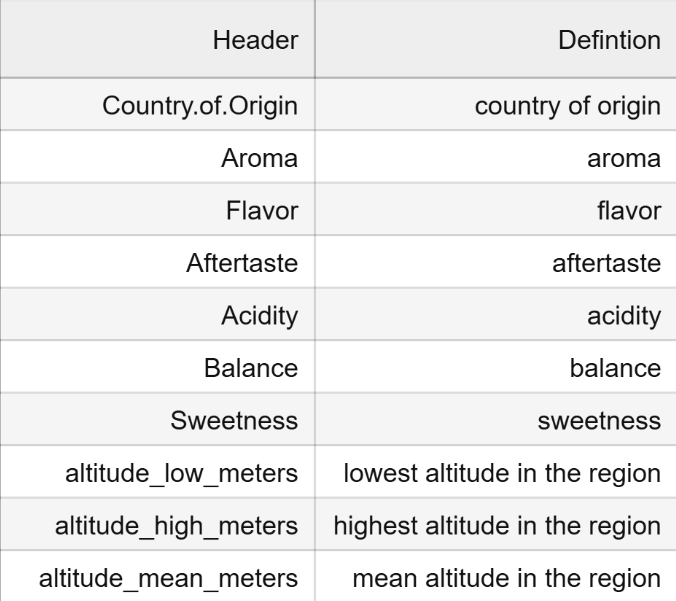
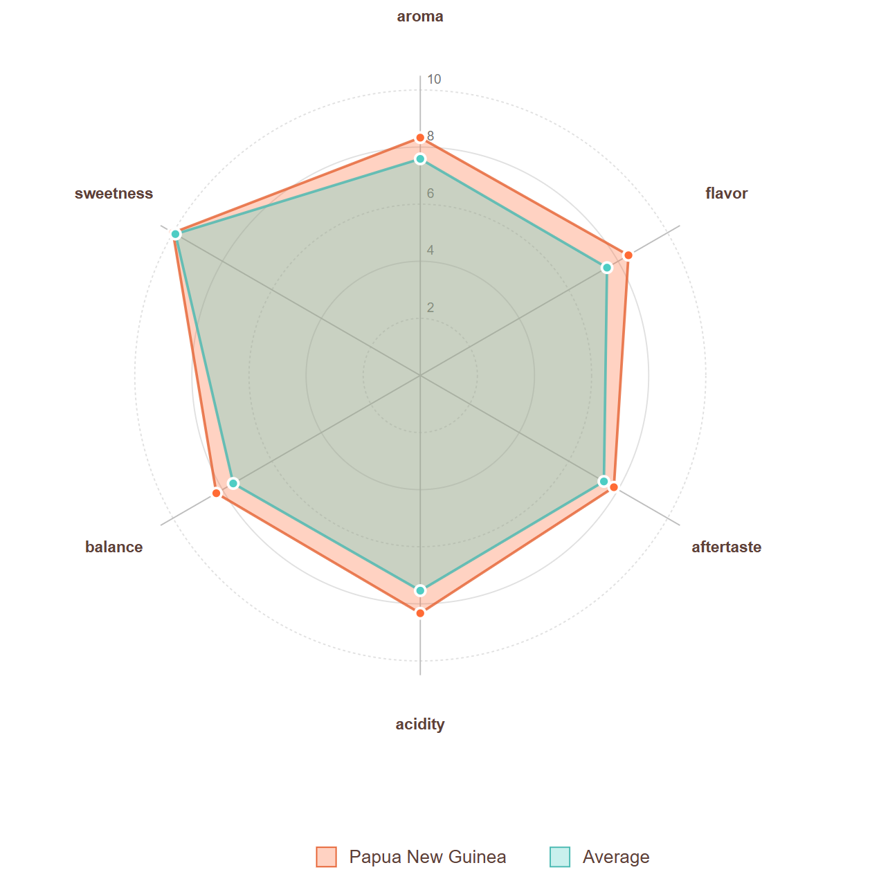
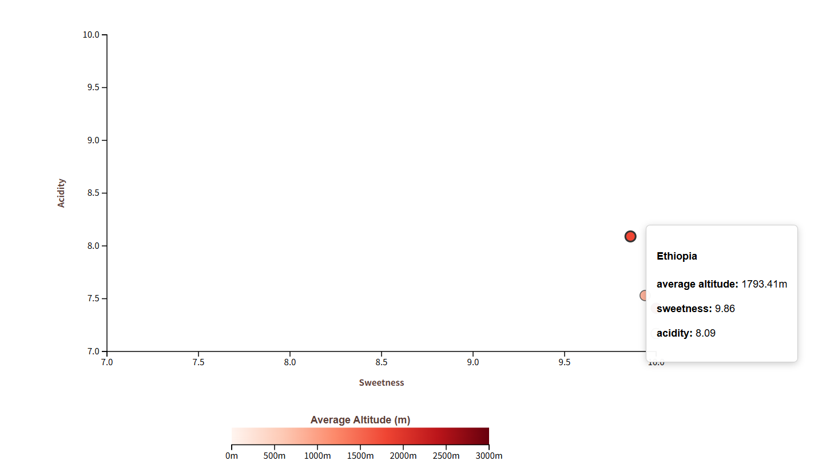

# ARTS 1422: Data Visualization, Fall 2025

## Homework 1

Note that D3.js is the only visualization library allowed to finish this assignment. In addition, please use d3.v4 or above.

### Problem 1

In this problem, we aim to visualize the taste of coffee. Each entry in the coffee_country_statistics.csv represents the coffee from its country of origin. Please refer to the data structure below for further details:

#### Task 1 (3 points):

- To have a better understanding of coffee in each region, six dimensions of is used to evaluate this, including `Aroma`, `Flavor`, `Aftertaste`, `Acidity`, `Balance`, `Sweetness`. Choose two regions and create a **Radar Chart** to visualize this. 	

*Hints: 
You don't need to visualize all the country of origins.
The resulting visualization should look similar like this example:*

#### Task 2 (5 points):

- We now want to explore the connections among altitude, region and coffee flavor. Visualize this part by constructing a scatter plot. In this scatter plot, the X-axis represents the `sweetness` of coffee, and the Y-axis represents its `acidity`. Each point represents a source, and the color of each point is encoded by its `altitude_mean_meters`. Additionally, when the mouse hovers over a point, display the corresponding region and altitude information in a tooltip for better clarity.

- Ensure the interface remains clear and aesthetically pleasing, and include a legend to illustrate the mapping between colors and values.

*Hints: 
You need to visualize all the country of origins.
For the color scale, use `d3.interpolateReds`, which takes values between 0 and 1 as input and interpolates between white and red to produce a color. (To explore more colorscales, visit https://github.com/d3/d3-scale-chromatic.)
The resulting visualization should look similar like this example:*

#### Task 3 (2 points):

A short report of your work: Take the screenshots of the visualization, describe the visualization and interesting patterns you find and try to explain the possible reasons. It should be less than 150 words.

### Submission:

- A `.html` file with your D3 JavaScript implementation of Task 1 and Task 2.
- A `.pdf` file of Task 3
- Put all above into a `姓名_学号.zip` file and submit.

>> PS: Our figures are just for your reference.